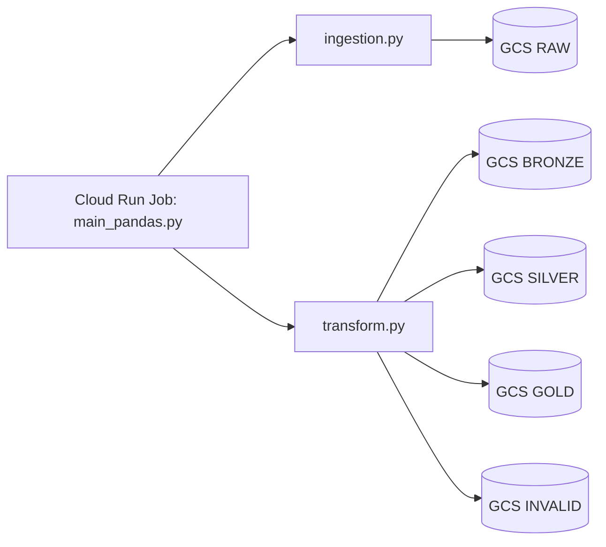

# Tourist Attractions Pipeline (Pandas + Cloud Run + GCS)

This branch focuses on a modular data pipeline that runs on GCP with:
- Cloud Run Jobs
- Docker
- Pandas
- Google Cloud Storage (GCS)

## Branch Purpose
Run an ingestion and transformation pipeline in modular steps:
1. Upload raw CSV to GCS (`ingestion.py`)
2. Transform and validate data with pandas (`transform.py`)
3. Orchestrate both steps (`main_pandas.py`)

## Architecture


## Repository Structure
- `main_pandas.py`: pipeline orchestrator (ingestion then transform)
- `ingestion.py`: uploads `Attraction_Belem.csv` to RAW bucket
- `transform.py`: pandas transformations and data quality checks
- `project_config.py`: local/GCP environment detection and paths
- `data/raw/Attraction_Belem.csv`: source file used by ingestion
- `Dockerfile`: container entrypoint for Cloud Run Job

## Data Layers
- Bronze: cleaned records from raw input
- Silver:
  - `dim_attractions`
  - `fact_reviews`
- Gold: valid records only
- Invalid: records that fail validation rules

## Environment Configuration
`project_config.py` switches paths automatically:
- local: filesystem paths under `data/...`
- gcp: bucket paths (`gs://...`) when `APP_ENV=gcp` or GCP runtime vars are present

## Local Run
```bash
python main_pandas.py
```

## Cloud Run Job (GCP) Summary
1. Build image with Cloud Build (`gcloud builds submit`)
2. Create/update Cloud Run Job using the built image
3. Set env vars, including:
   - `APP_ENV=gcp`
   - `PROJECT_ID`
   - `RAW_BUCKET`
   - `SOURCE_FILE_PATH`
   - `DESTINATION_BLOB_PATH`
4. Execute job and inspect logs/executions

## Required Dependencies
- Python 3.11+
- `pandas`
- `google-cloud-storage`

Install with:
```bash
pip install -r requirements.txt
```

## Validation Rules
`dim_attractions`
- `Attraction_id` required and unique
- `Name` required
- `Rating_Attraction` must be in valid range

`fact_reviews`
- `Username` required
- `Review` required
- `Date_Travel` required
- `Rating_Review` must be in valid range
- `Type_traveler` must be one of: `couples`, `families`, `alone`, `business`, `friends`
